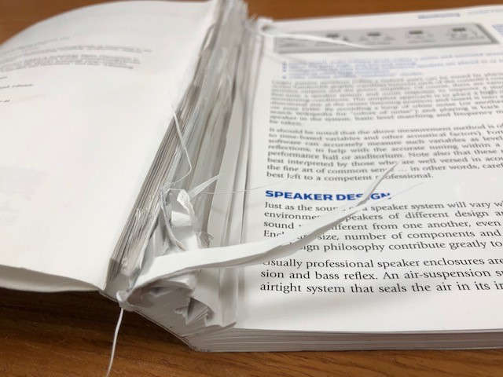

<>

## Past ##

Upon entering my final year of High School, I found myself in a situation where I had no idea what I was interested in and who I wanted to be in 4 years. Luckily, I entered into a new Unity course that was being offered. In this course, we created a simple Galaga-esque game. 

Though quite a simple concept created with simple copy-paste code provided by the instructor, my passion for coding was ignited. I spent the remainder of the year learning as much as I could about Unity and its intricacies. By the time I graduated High School, I published my first game to the Google Play Store. This was it, I finally knew what I wanted to do and I could imagine where I’d be in the future.

## Present ##

Within my first few years at the University of Hawaii, I learned mostly of C and its many variants, C++ and C#. At the same time, I spent some time on the side to learn Python, another great programming language, with a good friend. 

With it now being my last year here at UH Manoa, I want to branch out and learn as much as I possibly can about unfamiliar languages; JavaScript, SQL, Ruby, PHP, and Rust to name a few. I want to be familiar with as many languages as possible. I am partial to the thought that versatility, among a few other things, is key. Versatility and speed go hand in hand and will definitely widen opportunities in the future.

## Future ##

I am hopeful that the coursework provided at this University will aid me in my dream of becoming a piece in the creation of an important/popular Engineering solution and/or application. Though pay may be important to many, if I can do what I enjoy whilst also remaining sustainable, then that would be enough for me. 

I hope that my experiences here will open opportunities to work with many groups of people and bolster my understanding of what it means to have an organized workflow that conforms to company standards. In the future, I want to be a great Software Engineer.
