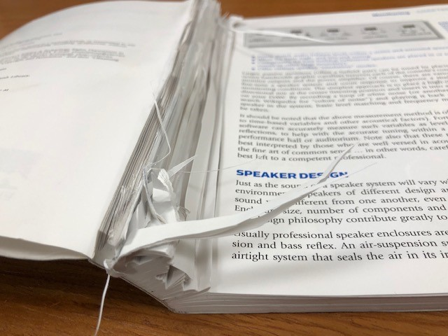

## *Telling a story, but without the meat* ##

After about a week of using JsFiddle to learn the basics of JavaScript, I can say with certainty that it is not something I am fond of. Most of the courses found in the Computer Engineering curriculum involves the use of C and C++. When learning the ins and outs of these languages, we were taught to “create code that tells a story”. 

Our code was meant to be clearly understood and flow naturally. This implies that variables and their assignments are coherent. However, in JavaScript, variable assignments aren’t clear or explicit. It feels as if I am writing a story without any ‘meat’ to back it up. 

Now, this isn’t to say that the vast amounts of short-hand expressions are inherently bad, rather, the oversimplification of a once clearly written program is. 

## The Warm Welcome of JavaScript

Ignoring the previous observations made, I think JavaScript is a good programming language when it comes to Web Design. From prior knowledge, I am aware that JavaScript, JS, pairs extremely well with HTML to create visually unique and user-friendly websites. 

Moreover, due to the many shorthand expressions and the vast simplifications when having to “define” variables, JS is really easy to understand for those seeking an introduction to programming. JS contrasts greatly with something like C. C is rigid and strict, while JS is lenient and free-flowing. Many who are exposed to the rules of C are often deterred as they feel too restricted (assuming they are unaware of the vast amount of possibilities Linux terminal C possesses at the user level). 

## The Key To Mastery

Being confident whilst coding is super important. Given a small window of time, a high-level programmer should be able to understand a given Engineering/software problem, question potential resolutions, and, given a smaller assignment, produce a basic framework of the program within a few minutes/hours. Without confidence in one's capabilities, a programmer's thought process will stutter and falter, effectively losing more time than necessary. 

This is where athletic software engineering comes into play. Practicing short, timed programming questions will aid in the growth of programming confidence and efficiency. This is why I find the WODs to be a worthwhile addition to the course material. I for one, struggle in the speed category. 

I prefer to think, think, and keep on thinking. Typically, the first idea isn’t the best or most efficient idea. To code quickly is to leave out things like edge cases. However, being able to produce a solution quickly and think on your toes is crucial for job interviews or producing prototypes. Both critical-thinking and efficiency are important. Having both traits are the key to a successful programming career. 
