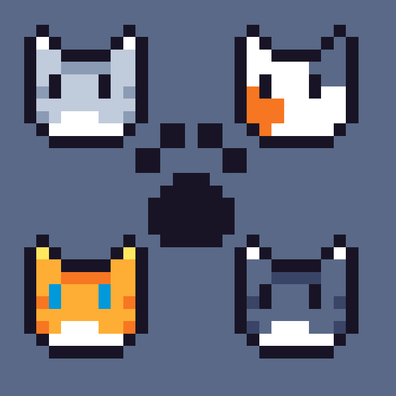

This C++ program collects user-provided data detailing everything to know about their cat (name, date of birth, species, gender, etc) and places the data within a singly linked list. This program can restructure the linked list, search/find specified cats, and can delete cats based on certain specifications.

Source: <a href="https://github.com/tliam1/ee205-animal-farm"><i class="large github icon "></i>tliam1/ee205-animal-farm</a>
