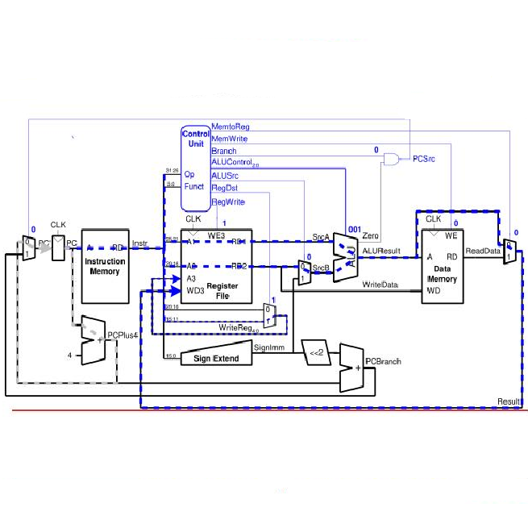

This program simulates the functions of a single-cycle processor by handling branches/conditional branches, additions, subtractions, and noOps. This program cycle shifts instruction sets through each stage of the processor (IF, ID, EX, MEM, and WB).

<pre>
IF: Instruction Fetch
ID: Instruction Decode
EX: Execute
MEM: Memory
WB: Write Back
</pre>

Source: <a href="www.edaplayground.com/x/GmVk"><i class="large github icon "></i>edaplaygound/ccp</a>
